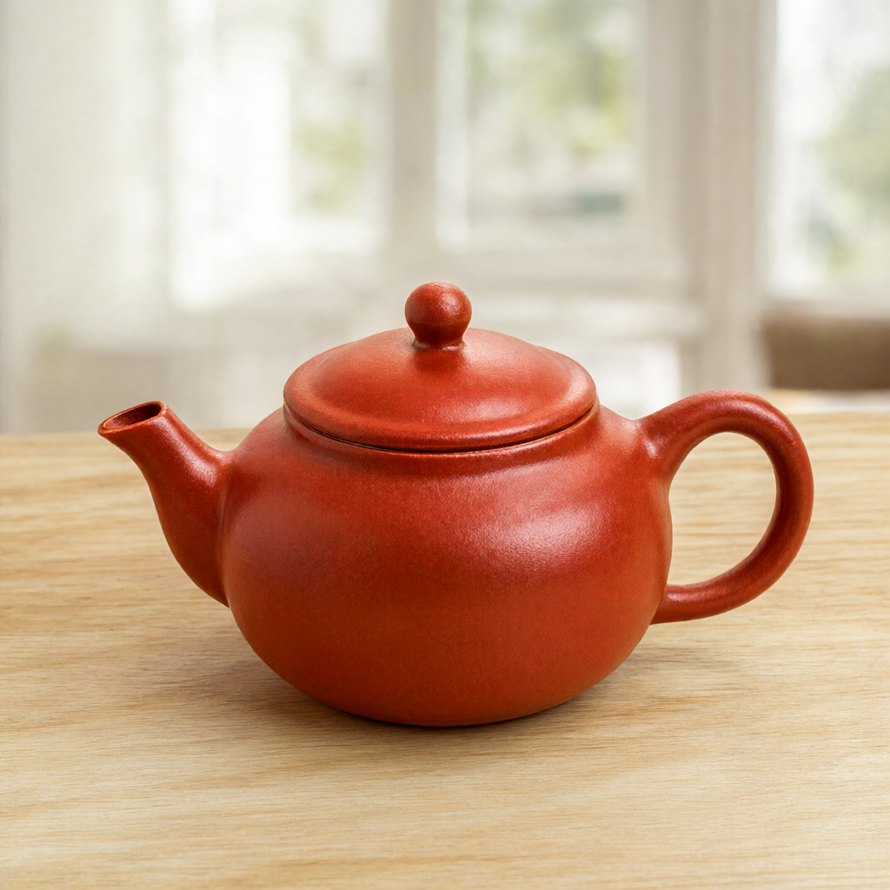
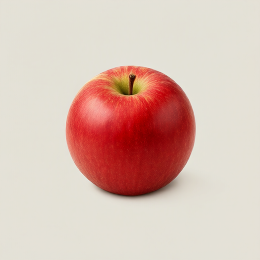

# Dreamer Local Image

独立的 Qwen-Image-2.1 本机 API 程序，面向 Windows x64 + NVIDIA 显卡。提供任务队列、图像生成/编辑、透明图、蒙版编辑、取消与结果下载，默认监听 `127.0.0.1:8790`。

本项目拥有独立源码、版本、测试和发布包。任何 HTTP 客户端都能接入；Dreamer 是其中一个客户端，不是运行依赖。服务与启动器采用 MIT 许可证，模型权重适用各自许可证，详见 [NOTICE.md](NOTICE.md)。

## 启动与连接

1. 解压至可写目录，双击 `Start.cmd`。首次启动自动准备独立 Python、CUDA 版 PyTorch 和推理依赖；需要联网。系统需已安装 NVIDIA 驱动。
2. 打开 `http://127.0.0.1:8790`，点击“加载模型”，或直接从 Dreamer 提交生成。首次使用会从 Hugging Face 下载模型，保存在本包 `models/`；请预留足够磁盘与系统内存。
3. 在已支持本地服务的 Dreamer 版本中，直接在最终确认卡片选择 **Qwen 本地**，核对参数后点击生成。两边默认使用 `http://127.0.0.1:8790`，同一台电脑无需填写地址或 API Key；只有主动修改服务端口时，才需要在 Dreamer 设置中调整地址。
4. 关闭服务窗口或 Ctrl+C 停止服务。重新启动不会重复提交历史任务；进行中的旧任务标记为中断，完成结果可重新查询。

这是**首次联网安装型一键包**，不包含模型权重、CUDA 运行时或 NVIDIA 驱动。生成依赖准备好后可从缓存运行。`settings.json` 首次启动时自动生成，可修改端口、模型目录和显存模式；本地模型路径须是完整的 Diffusers 模型目录。

默认采用 **NF4 量化 + model 按组件卸载**，文本编码器和图像 Transformer 依次量化并停放到 CPU，降低加载峰值。仍需下载约 33GB 官方原始权重；量化发生在本机，不捆绑第三方量化模型。

`settings.json` 中 `quantization` 可选 `nf4` / `none`；`offload` 可选 `model` / `sequential` / `none`。NF4 支持 `model` 和 `none`，不支持逐层 `sequential` 卸载。未量化模型可以使用 `sequential`，但需要更多系统内存。实际验证设备、参数、耗时与限制见 [验证记录](docs/validation.md)。

`vae_tile_size` 默认 1024，让 1K 图片整张解码，较大的图片再分块。256px 小分块虽然省显存，但在实测中会产生可见接缝；显存不足时优先降低输出分辨率。NF4 会带来量化精度取舍，不承诺与 BF16 输出完全相同。

Dreamer 的普通最终确认、快速描述最终卡片，以及已完成几何准备的扩图最终卡片支持切换；扩图保留已锁定的比例。简洁模式、自动提交浮条和道具库独立生成入口仍使用各自原有服务。会话托盘默认按 GRS 容量勾选，切到 Qwen 后可在最终卡片手动勾选更多参考图，合计最多 10 张（含主图与异形选区系统图）。两组参数按卡片保存；切回时恢复，已提交任务与历史结果始终绑定当时的服务地址。

## API

交互文档在 `/docs`，OpenAPI 在 `/openapi.json`。图像任务为异步协议，与 GRS 类似的“提交、查询、获取结果”，不是声称兼容 GRS 或 OpenAI 全部协议。

| 路径 | 方法 | 功能 |
|---|---|---|
| `/health` | GET | 服务、模型、显存状态 |
| `/v1/models`、`/v1/capabilities` | GET | 模型与实际公开的能力、参数范围 |
| `/v1/model/load`、`/v1/model/unload` | POST | 排队加载/卸载，返回任务 |
| `/v1/images/generations`、`/v1/images/edits` | POST | 提交任务，返回 id；图片通过 `images` 的 base64/data URL 数组传递 |
| `/v1/tasks` | GET | 最近 50 个任务 |
| `/v1/tasks/{id}` | GET / DELETE | 查询 / 请求取消（运行中在采样步边界停止，加载中需等待加载结束） |
| `/v1/tasks/{id}/images/{index}` | GET | 下载 PNG，index 从 1 开始 |

示例请求：

```json
{"model":"Qwen/Qwen-Image-2.1","prompt":"一只戴着巫师帽的小水豚","width":1024,"height":1024,"n":1,"steps":40,"seed":42,"use_kv_cache":true,"request_id":"my-job-001"}
```

普通 Python 客户端示例（只用标准库）：

```shell
python examples/client.py "A ceramic red teapot on a wooden table" --seed 42
python examples/client.py "Change the background to a sunset beach" --image input.png
python examples/client.py "A cheerful yellow star sticker" --transparent --output star.png
```

支持 `negative_prompt`、`guidance_scale`（默认 1；负面提示词需大于 1）、`background: "transparent"`、最多 10 张输入、1–8 张串行输出。宽高为 32 的倍数，256–4096，面积最多 4194304。相同 `request_id` 与参数返回同一任务；参数不同返回 409，不重复生成。请求正文不持久化原图、提示词；任务参数、状态及 PNG 保存在 `data/tasks`。

`mask` 是可选 base64 灰度图，与第一张图同尺寸：白色编辑、黑色保留。当前 Diffusers 管线没有独立 mask 输入；服务把蒙版作为最后一张参考图并追加说明，再以蒙版把生成结果与原图合成。此时普通输入最多 9 张，不声称原生 latent inpainting。Dreamer 首期仍沿用现有 Photoshop 选区/回贴链路，独立 API 的 mask 能力供外部调用。

透明背景采用官方提示词封装，返回模型实际 PNG 通道，不以强制添加全不透明 alpha 冒充透明效果。LoRA 与独立提示词改写模型尚未接入。

服务默认无账号，仅接受本机回环地址；浏览器跨源请求被拒绝。未提供局域网监听或公共网络部署。模型更新可以独立于 Dreamer 更新，但需保持 `dreamer-local-image-v1` 接口。

## 模型来源与授权

- [官方权重及模型说明](https://huggingface.co/Qwen/Qwen-Image-2.1)
- [Diffusers Qwen Image 2.1](https://huggingface.co/docs/diffusers/main/api/pipelines/qwenimage21)
- [Qwen Research License](https://github.com/QwenLM/Qwen-Image-2.1/blob/main/LICENSE)：当前模型限定非商业研究/评估，商业使用须另行取得授权。一键包不附模型权重，不改变模型授权要求。

## 构建

运行 `python build_package.py`，得到 `dist/Dreamer-Local-Image-NVIDIA-0.1.0.zip` 和 SHA-256。只打包明确列出的代码与说明，不含模型、运行时、设置或用户结果。Dreamer 主程序不依赖 torch / diffusers；它只使用 HTTP 适配器。

## 开发与验证

```shell
python -m pip install -r requirements-dev.txt
python -m pytest
```

单元/API 测试不下载模型。真实 GPU 接口验收需启动已安装推理依赖的服务，再运行 `runtime\python.exe -s scripts\qa_gpu.py`；它仅创建合成测试图片，覆盖文生图、单图编辑、多参考图、透明图、蒙版和批量生成。输出与报告保存在被 Git 忽略的 `validation-output/`。

可以提前下载指定版本的官方模型：`python scripts/download_model.py`（需要 `filelock`，推理环境已包含）。下载支持继续未完成的文件；完成后把 `settings.json` 的 `model` 改为下载目录。对外客户端继续使用固定模型 ID `Qwen/Qwen-Image-2.1`。

## 本机实测输出

以下是 RTX 3060 12GB 上通过本项目 API 生成的原始 PNG，未进行后期修图。测试输入均为合成素材。



 
